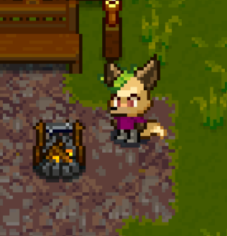

# Necesse Race Mod

  

## Overview  
This mod overhauls the internal systems of Necesse to support character races with custom body part customizations. 

## Warnings
RaceMod is currently released as a very early ALPHA. Crashes may occur, so do back up your game data.
This mod take steps to preserve your character data, such as saving in a different directory than base game characters. Even so, back up your characters and worlds.

**THIS IS NOT A CLIENT SIDE MOD** 

Both server and client must have this mod installed to allow clients to join with custom races. Even if you do manage to get past the server mod dependency prompt, it will at **best** not work, and at worst corrupt your character save.
Installing this mod, creating characters that are linked to a world, and then disabling this mod will remove the custom attributes of the world-embedded characters.

## Support
Please join the discord modding channel for Necesse and let me know if you have any suggestions or issues. 

## Patch Notes
0.0.19 - Stylist form fix, Debug form fix, Stylist cost fix, Reposition toggle clothes button on customization form.