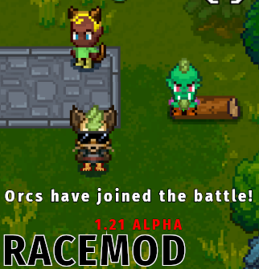

# Necesse Race Mod

  

## Overview  
This mod overhauls Necesse to support the use of multiple character races. 

## Features
* Adds Orc, Beastfolk, and Neko races into the game for selection at character creation.
* Allows toggle-able clothes during character creation.
* Adds two items ("The Emperor's New Shirt" and "The Emperor's New Shoes") to the Elder's shop. These cosmetic items serve to simply hide pieces of armor.
  
  

## Technical Information
Several systems work in unison in order to make adding multiple races possible.

### Two-level LRU Caching
Each race generates textures for each variation and color that each body part offers. This can be very intensive on memory usage if the textures are generated and held-in memory for the duration of the application's lifetime - which is what Necesse currently does. To work around this, I implement a two-level least recently used cache in order to cache generated textures for future use and load textures when they are needed instead of when the game starts. Layer one stores a limited number of GameTexture types in memory, evicting the eldest textures and freeing resources when the cache is at capacity. Layer-two holds a limited number of textures as byte-data in memory, and stores evicted textures in an on-disk cache for later recall.

When a texture is requested, layer one will check it's own cache for the GameTexture. If it's not found, it will communicate with layer two, which will then check it's own cache for the byte data of a texture. If it is still not found, layer-two will check it's cache index to see if a texture's byte data is being stored on disk. If it is, then it pulls that information from the on-disk cache and hands it back to layer one. If it isn't, then a new GameTexture is made and then cached.

### Race Data Factory
Race mod utilizes ByteBuddy to patch many in-game classes and methods to support the things that it adds. One of the classes that Race Mod interacts with is Necesse's HumanLook class - which as the name suggests, stores a player's appearance. ByteBuddy has it's limitations on what can and cannot be done at runtime, and to avoid needing to replace or modify the structure of HumanLook, I use a class that extends the HumanLook type in order to define custom race information. This information is stored in a separate class dedicated to handling the custom race appearance of multiple entities, the RaceDataFactory. When a player's appearance is drawn, the RaceDataFactory is queried for information about an entities race, and if found - uses this information to modify the draw process used by the game.

## Warnings
RaceMod is currently released as a very early ALPHA. Crashes may occur: do back up your game data.
This mod take steps to preserve your character data, such as saving in a different directory than base game characters. Even so, back up your characters and worlds.

**THIS IS NOT A CLIENT SIDE MOD** 
Both server and client must have this mod installed to allow clients to join with custom races. Even if you do manage to get past the server mod dependency prompt, it will at **best** not work, and at worst corrupt your character save.

## Support
Please join the modding channel in Necesse's discord and let me know if you have any suggestions or issues. Alternatively, comment in the appropriate steam workshop thread for bugs/issues/suggestions. I will probably not respond to random friend requests.

## Patch Notes

0.1.22 - Cache improvements, Fix for silent errors when blank Orc facial hair is selected.

0.1.21 - Introduced Orcs, Neko Race, Texture Loader overhaul.

0.0.21 - Called it. Updated for hotfix 0.32.1

0.0.20 - Micro-update for new patch. Expect another, because Stylists are broken.

0.0.19 - Stylist form appearance fix, Debug form appearance fix, Stylist cost fix, Reposition toggle clothes button on customization form.

0.0.18 - Fixed an issue with new ear drawing positions breaking in water. In general, fixed issues I caused in the last patch. :(

0.0.17 - Fixed ear drawing positions. Added digitigrade legs option in feet for furry race. Added a new body style to furry with a very minor change for experimentation. Fixed crash on randomization.

0.0.16 - Versioning system, clothes toggle on customization form, compatibility fixes, fixes for muzzle drawing in front of arms, custom eye sprites that do not have the base game skin color dots in the middle.

0.0.15 - Issues with settlement claiming.

0.0.14 - Multiplayer appearance/Broken models.

0.0.13 - Null settings field handling.

0.0.12 - Server permissions, debug form, invisible head, tail artifacts on #2